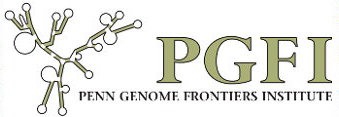

# 2011 Sponsors




# Organizing Sponsors

  

    
    {{ "" | markdownify | remove: '
' | remove: '
' }}

    {{ "" | markdownify | remove: '
' | remove: '
' }}

    {{ "" | markdownify | remove: '
' | remove: '
' }}
    

    

    

    

  

  

    
    {{ "" | markdownify | remove: '
' | remove: '
' }}

    {{ "" | markdownify | remove: '
' | remove: '
' }}
    

    

    
  

<!-- Table -->
<!-- 355px wide -->
